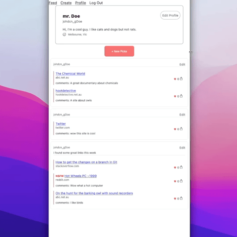

# <b>picks</b>
<br/>

### <b><i>picks</i> is a link sharing web app with a limit of 5 links per post, [visit the live app](https://picks.didley.dev)</b>
<br/>
The client is built with react without hooks, Redux & Sagas for state management,<br/>
React Testing Library & Mock Service Worker for client testing and the backend<br/>
is built with express & mongoose.<br/>
<br/>

##### <i>The [backend API](https://github.com/didley/picks-api) has been moved to a separate repo while Heroku lacks monorepo support</i>
<br/>

## Demo


### Setup

```console
$ cd picks
$ yarn install
```

### Running

- [ ] Remove .example form .env.example in ~~/backend &~~ /client_web

```console
# run client
$ cd client_web
$ yarn start

# run client tests
$ cd client_web
$ yarn test
```

